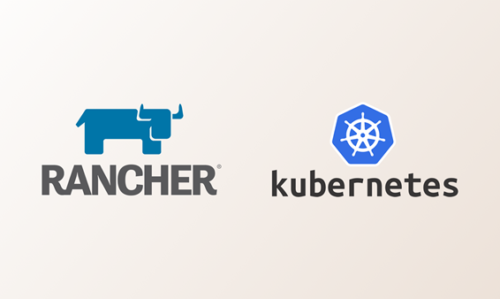

<h1 align="center">DevOps - Rancher e Kubernetes</h1>

  
  

  <a href="#-projeto">Projeto</a>&nbsp;&nbsp;&nbsp;|&nbsp;&nbsp;&nbsp;
  <a href="#-tecnologias">Tecnologias</a>&nbsp;&nbsp;&nbsp;|&nbsp;&nbsp;&nbsp;
  <a href="#%EF%B8%8F-ambiente">Ambiente</a>&nbsp;&nbsp;&nbsp;|&nbsp;&nbsp;&nbsp;
  <a href="#-etapas">Etapas</a>&nbsp;&nbsp;&nbsp;|&nbsp;&nbsp;&nbsp;
  <a href="#-licença">Licença</a>&nbsp;&nbsp;&nbsp;|&nbsp;&nbsp;&nbsp;
  <a href="#-referências">Referências</a>

  

## 🌱 Projeto

- Estudo `Rancher` e `Kubernetes`. 

## ✨ Tecnologias

- Vagrant
- Ansible
- Kubspray
- Kubernetes
- Docker
- Haproxy
- Haproxy Ingress Controller
- Rancher
- Virtualbox
- Cert-manager

## 🚀 Etapas

0. [Subir um balanceador dockerizado localmente.](/src/balanceador/Readme.md) 
1. [Criar as Vm's.](/src/vagrant/Readme.md)
2. [Subir um cluster kubernetes.](/src/kubespray/README.md)
3. [Instalar o Helm.](/src/helm/helm.md)
4. [Deployar o Cert-manager.](/src/rancher/cert-manager.md)
5. [Criar um emissor.]
6. [Deployar o Rancher.](/src/rancher/rancher.md)
7. [Gerar certificado.]
8. [Configurar um Ingress.]

## Subindo kubernetes utilizando o `kubespray`

0. cd /kubespray
1. sudo pip3 install -r requirements.txt
2. cp -rfp inventory/sample inventory/mycluster
3. declare -a IPS=(192.168.50.30 192.168.50.11 192.168.50.12 192.168.50.20 192.168.50.41)
4. CONFIG_FILE=inventory/lab-k8s/hosts.yaml python3 contrib/inventory_builder/inventory.py ${IPS[@]}
5. ansible-playbook -i inventory/lab-k8s/hosts.yaml  --become -u vagrant --become-user=root cluster.yml

## 📄 Licença
Esse projeto está sob a licença MIT. Veja o arquivo [LICENSE](LICENSE) para mais detalhes.

## 🙇 Referências

- https://github.com/kubernetes-sigs/kubespray
- https://kubernetes.io/docs/setup/production-environment/tools/kubespray/