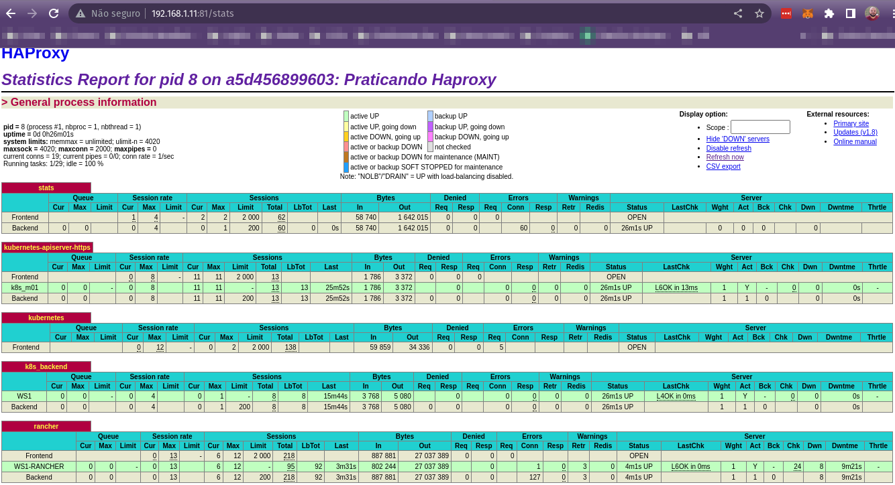

<h1 align="center">Balanceador - Haproxy</h1>

<p align="center">
  
</p>

## Docker Compose File

```docker-compose
haproxy:
    image: haproxy:1.8
    volumes:
        - ./haproxy:/haproxy-override
        - ./haproxy/haproxy.cfg:/usr/local/etc/haproxy/haproxy.cfg:ro
        - ./haproxy/rancher.pem:/usr/local/etc/haproxy/rancher.pem
    ports:
        - "80:80"
        - "81:81"
        - "441:441"
        - "6443:6443"
        - "443:443"
```

- Mapeamento para o diretório haproxy contendo aruivo de configuração `haproxy.cfg`;
- Criação de um certificado para colococar nesse diretório haproxy;
- Inicialização do container:

```bash
docker-compose up -d
```