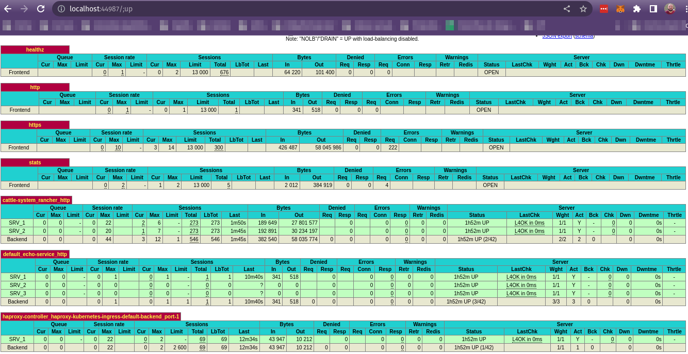

<h1 align="center">Haproxy Ingress Controller</h1>

<p align="center">
  
</p>

## Configurar o Haproxy ingress Controller no Cluster K8S
```bash
kubectl apply -f https://raw.githubusercontent.com/haproxytech/kubernetes-ingress/v1.8/deploy/haproxy-ingress.yaml
```

- https://github.com/jcmoraisjr/haproxy-ingress